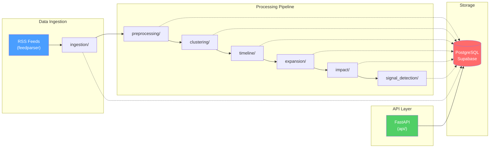
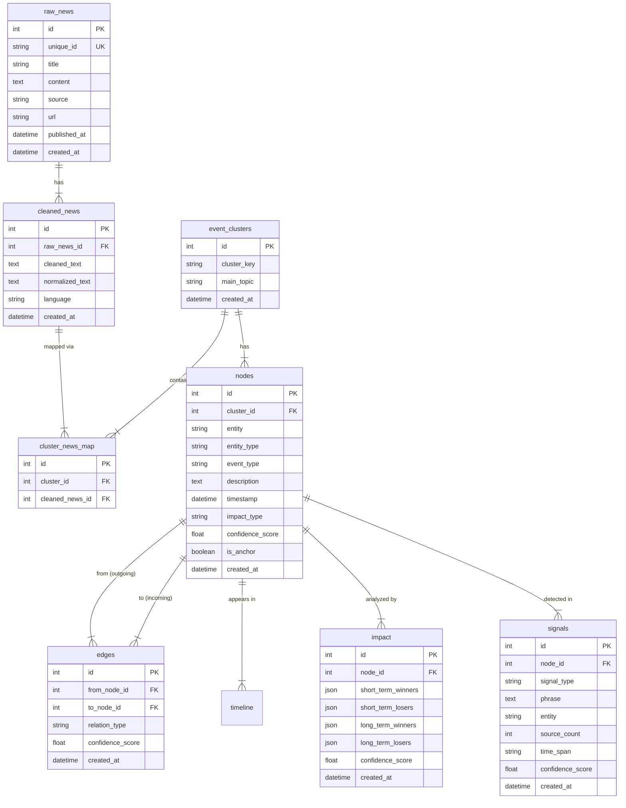

# DeepDive Intelligence — Project Analysis Report

> **Project:** News Intelligence Backend  
> **Generated:** 2026-03-31  
> **Total Python Files:** 33 &nbsp;|&nbsp; **Total LOC (excl. `__init__`):** ~1,510  
> **Tech Stack:** FastAPI · SQLAlchemy ORM · PostgreSQL (Supabase) · feedparser  
> **Version Control:** Not initialized (no `.git` directory)

---

## 1. Executive Summary

DeepDive Intelligence is a **deterministic, rule-based** Python backend that ingests news articles via RSS feeds, cleans and clusters them, builds a chronological timeline with causal edges, performs rule-based impact analysis, and detects weak signals — all without any LLM or ML dependencies.

The codebase is well-structured with clear separation of concerns across **10 domain modules**, a clean FastAPI layer, and a robust SQLAlchemy model layer with proper relationships, cascading deletes, and indices. The project is in an **early-to-mid stage** — the core pipeline is functional end-to-end but lacks production hardening, testing, logging granularity, and several enhancement opportunities.

### Maturity Scorecard

| Dimension | Score | Notes |
|---|:---:|---|
| Architecture & Modularity | ⭐⭐⭐⭐ | Clean module boundaries, single-responsibility services |
| Database Design | ⭐⭐⭐⭐ | Proper FKs, indices, cascades, relationships |
| Pipeline Orchestration | ⭐⭐⭐ | Sequential, synchronous, no retry/resume |
| API Design | ⭐⭐⭐ | Good read endpoints, limited write/admin surface |
| Code Quality | ⭐⭐⭐⭐ | Type hints, dataclasses, clean Python |
| Testing | ⭐ | No tests found |
| Error Handling | ⭐⭐ | Broad exception catch in pipeline, minimal elsewhere |
| Logging / Observability | ⭐⭐ | Pipeline logging only, no structured output |
| Security | ⭐⭐ | No auth, CORS not configured, secrets in `.env` |
| Documentation | ⭐⭐⭐ | Good README, inline docstrings present |

---

## 2. Architecture Overview



### Pipeline Flow (7 Steps)

| Step | Module | Input | Output | Persisted To |
|:---:|---|---|---|---|
| 1 | `ingestion/` | RSS feed URLs from `RSS_FEEDS` env var | Normalized raw articles | `raw_news` |
| 2 | `preprocessing/` | Unprocessed `raw_news` rows | HTML-cleaned, normalized, deduplicated text | `cleaned_news` |
| 3 | `clustering/` | Unclustered `cleaned_news` rows | Event clusters with keyword+text similarity | `event_clusters`, `cluster_news_map` |
| 4 | `timeline/` | All `event_clusters` with stats | Scored nodes, causal edges, ordered timeline | `nodes`, `edges`, `timeline` |
| 5 | `expansion/` | Timeline nodes (seeds) | BFS-expanded related nodes/edges (depth ≤2) | `nodes`, `edges` |
| 6 | `impact/` | All nodes | Winner/loser classification per event type | `impact` |
| 7 | `signal_detection/` | All nodes | Uncertainty phrase detection | `signals` |

---

## 3. Project Directory Structure

```
deepdive-intelligence/
├── main.py                          # Re-export: from api.main import app
├── requirements.txt                 # 7 dependencies (no pinned versions)
├── .env.example                     # App + DB config template
├── .gitignore                       # .venv, __pycache__, .env
├── README.md                        # Setup & overview
│
├── api/                             # FastAPI application layer
│   ├── main.py                      # App factory, startup event, router registration
│   ├── deps.py                      # DB session dependency
│   └── routers/
│       ├── health.py                # GET /health
│       └── intelligence.py          # GET /event, /timeline/{id}, /impact/{id},
│                                    #     /signals/{id}, POST /pipeline/run
│
├── database/                        # DB infrastructure
│   ├── base.py                      # DeclarativeBase
│   ├── config.py                    # Pydantic Settings (env-driven)
│   └── session.py                   # Engine, SessionLocal, create_tables()
│
├── models/                          # SQLAlchemy ORM models
│   ├── article.py                   # Article (appears unused / legacy)
│   └── news_intelligence.py         # RawNews, CleanedNews, EventCluster,
│                                    # ClusterNewsMap, Node, Edge,
│                                    # TimelineEntry, Impact, Signal
│
├── ingestion/                       # Step 1: RSS feed fetching + DB insertion
│   ├── rss.py                       # feedparser wrapper
│   └── service.py                   # RawArticle dataclass, duplicate-safe insert
│
├── preprocessing/                   # Step 2: Text cleaning + dedup
│   └── service.py                   # HTML stripping, normalization, fuzzy dedup
│
├── clustering/                      # Step 3: Rule-based event clustering
│   └── service.py                   # Keyword overlap + text similarity
│
├── timeline/                        # Step 4: Chronological ordering + edges
│   └── service.py                   # Scoring, anchor selection, edge creation
│
├── expansion/                       # Step 5: BFS graph expansion
│   └── service.py                   # Entity/context/time gated expansion
│
├── impact/                          # Step 6: Winner/loser classification
│   └── service.py                   # Rule-based event-type impact
│
├── signal_detection/                # Step 7: Uncertainty signal extraction
│   └── service.py                   # Phrase matching + confidence scoring
│
└── utils/                           # Shared utilities
    └── rules.py                     # contains_any() helper (currently unused)
```

---

## 4. Module-by-Module Deep Dive

### 4.1 Database Layer — [database/](file:///d:/deepdive-intelligence/database/)

| File | LOC | Purpose |
|---|:---:|---|
| [base.py](file:///d:/deepdive-intelligence/database/base.py) | 6 | SQLAlchemy `DeclarativeBase` |
| [config.py](file:///d:/deepdive-intelligence/database/config.py) | 40 | Pydantic `Settings` with `.env` loading |
| [session.py](file:///d:/deepdive-intelligence/database/session.py) | 36 | Engine creation, `SessionLocal`, table creation |

**Strengths:**
- Clean separation of config, session, and base
- `pydantic-settings` for type-safe env loading with `lru_cache`
- `pool_pre_ping=True` for connection resilience
- `future=True` for SQLAlchemy 2.0 style

**Issues:**
- ⚠️ `datetime.utcnow` is deprecated since Python 3.12 — should use `datetime.now(timezone.utc)`
- ⚠️ `@app.on_event("startup")` is deprecated in FastAPI — use `lifespan` context manager
- No Alembic migration setup — relies on `create_all()` which can't handle schema changes

---

### 4.2 Models — [models/](file:///d:/deepdive-intelligence/models/)

| Model | Table | Columns | Relationships |
|---|---|:---:|---|
| `RawNews` | `raw_news` | 7 | → `CleanedNews` (1:N) |
| `CleanedNews` | `cleaned_news` | 6 | → `RawNews` (N:1), → `ClusterNewsMap` (1:N) |
| `EventCluster` | `event_clusters` | 4 | → `ClusterNewsMap` (1:N), → `Node` (1:N) |
| `ClusterNewsMap` | `cluster_news_map` | 3 | → `EventCluster` (N:1), → `CleanedNews` (N:1) |
| `Node` | `nodes` | 11 | → `EventCluster` (N:1), → `Edge` (1:N both ways), → `TimelineEntry` (1:N), → `Impact` (1:N), → `Signal` (1:N) |
| `Edge` | `edges` | 5 | → `Node` (N:1 from + to) |
| `TimelineEntry` | `timeline` | 4 | → `Node` (N:1) |
| `Impact` | `impact` | 8 | → `Node` (N:1) |
| `Signal` | `signals` | 8 | → `Node` (N:1) |
| `Article` | `articles` | 6 | None (⚠️ appears unused) |

**Database Schema (ER Diagram):**



**Strengths:**
- Proper `CASCADE` deletes on all foreign keys
- Extensive index coverage (15+ custom indices)
- `UniqueConstraint` on dedup-critical fields
- Modern `Mapped[]` typed column syntax (SQLAlchemy 2.0)
- JSON columns for flexible impact data

**Issues:**
- ⚠️ `Article` model exists but is **never referenced** anywhere in the pipeline — likely a legacy remnant
- ⚠️ No `updated_at` column on any table — makes change tracking impossible
- ⚠️ Node-to-Impact/Signal is 1:N but impact analysis uses scalar queries (assumes 1:1)

---

### 4.3 Ingestion — [ingestion/](file:///d:/deepdive-intelligence/ingestion/)

| File | LOC | Purpose |
|---|:---:|---|
| [rss.py](file:///d:/deepdive-intelligence/ingestion/rss.py) | 50 | RSS feed parsing via `feedparser` |
| [service.py](file:///d:/deepdive-intelligence/ingestion/service.py) | 81 | Dedup-safe insertion into `raw_news` |

**How it works:**
1. Feed URLs loaded from `RSS_FEEDS` env var (comma-separated)
2. Each feed parsed with `feedparser`, entries normalized to dicts
3. SHA-256 unique ID generated from `title|source|published_at`
4. Duplicate check before insert

**Issues:**
- ⚠️ No timeout on `feedparser.parse()` — hangs on unresponsive feeds
- ⚠️ No error handling for network failures during feed fetch
- ⚠️ RSS_FEEDS not in `.env.example` — undiscoverable configuration
- ⚠️ Source name inferred from URL domain — could be made more descriptive
- ⚠️ Only RSS supported — no support for REST APIs, webhooks, or scraping

---

### 4.4 Preprocessing — [preprocessing/](file:///d:/deepdive-intelligence/preprocessing/)

| File | LOC | Purpose |
|---|:---:|---|
| [service.py](file:///d:/deepdive-intelligence/preprocessing/service.py) | 118 | HTML stripping, normalization, language detection, fuzzy dedup |

**How it works:**
1. Finds `raw_news` rows without a matching `cleaned_news` record
2. **Exact dedup:** checks `unique_id` against already-processed set
3. **Fuzzy dedup:** `SequenceMatcher` on normalized headlines (threshold: 0.92)
4. Cleans HTML tags, strips special chars, normalizes whitespace
5. Lightweight language detection: ASCII ratio ≥ 0.85 → `"en"`, else `"unknown"`

**Strengths:**
- Two-layer deduplication is solid
- Compiled regex patterns for performance

**Issues:**
- ⚠️ Fuzzy dedup is **O(n²)** — `is_fuzzy_duplicate` compares each headline against all existing; will not scale past ~5,000 headlines
- ⚠️ Language detection is extremely simplistic — won't distinguish French/Spanish/etc. from English
- ⚠️ `content` is cleaned but `title` is only used for dedup, never cleaned

---

### 4.5 Clustering — [clustering/](file:///d:/deepdive-intelligence/clustering/)

| File | LOC | Purpose |
|---|:---:|---|
| [service.py](file:///d:/deepdive-intelligence/clustering/service.py) | 175 | Single-pass greedy clustering by keyword overlap + text similarity |

**Algorithm:**
1. Load unclustered `cleaned_news` rows (batch: 500)
2. For each item, extract top-20 keywords (tokens ≥ 3 chars, stopwords removed)
3. Compare against existing cluster buckets: `score = 0.6 * keyword_overlap + 0.4 * text_similarity`
4. If `score ≥ 0.45` → add to best bucket; else → create new bucket
5. Persist as `EventCluster` + `ClusterNewsMap` entries

**Issues:**
- ⚠️ **Greedy single-pass** — cluster quality depends on insertion order; no re-balancing
- ⚠️ `SequenceMatcher` on full text is **O(n·m)** per comparison — slow for long articles
- ⚠️ `main_topic` is just the first 3 sorted keywords — not semantically meaningful
- ⚠️ Cluster key includes `first_member_id` — same topic arriving later creates a different cluster
- ⚠️ No merge logic — once clustered, items can't be re-clustered if better data arrives

---

### 4.6 Timeline — [timeline/](file:///d:/deepdive-intelligence/timeline/)

| File | LOC | Purpose |
|---|:---:|---|
| [service.py](file:///d:/deepdive-intelligence/timeline/service.py) | 254 | Node scoring, anchor selection, edge creation, timeline ordering |

**Algorithm:**
1. Compute per-cluster stats: frequency, source count, recency
2. Score: `frequency + source_count + recency_score` (recency normalized to 30-day window)
3. Select anchor cluster (highest score)
4. Create/update `Node` per cluster with derived entity, event_type, description
5. Sort nodes chronologically, pin anchor at position 0
6. Create backward causal edges using keyword rules (`causes`, `triggers`, `precedes`)
7. Delete old timeline entries for group, insert ordered entries

**Issues:**
- ⚠️ **Destructive rebuild** — deletes all timeline entries for the group on every run
- ⚠️ `_get_or_create_node` does one DB query per cluster — N+1 pattern
- ⚠️ Only one timeline group is ever created (based on anchor) — multi-story support missing
- ⚠️ Uses PostgreSQL `func.string_agg` which isn't portable to other databases

---

### 4.7 Expansion — [expansion/](file:///d:/deepdive-intelligence/expansion/)

| File | LOC | Purpose |
|---|:---:|---|
| [service.py](file:///d:/deepdive-intelligence/expansion/service.py) | 193 | BFS graph expansion from timeline seed nodes |

**Algorithm:**
1. Collect all nodes that appear in a `TimelineEntry` as seeds
2. Build cluster snapshot with aggregated text and timestamps
3. BFS with gates: entity overlap → context similarity (≥ 0.35) → time proximity (≤ 7 days)
4. Create new nodes and `expands_to` edges for qualifying clusters
5. Depth capped at 2

**Strengths:**
- Three-gate filtering prevents runaway expansion
- Hard depth cap is a sensible safeguard

**Issues:**
- ⚠️ `string_agg` used for context text — not portable, and can produce very large strings
- ⚠️ Loads ALL edges into memory for dedup — won't scale
- ⚠️ Node counting logic is inconsistent (checks `cluster_id not in seed_nodes` but `seed_nodes` is a list of Nodes, not cluster IDs)

---

### 4.8 Impact — [impact/](file:///d:/deepdive-intelligence/impact/)

| File | LOC | Purpose |
|---|:---:|---|
| [service.py](file:///d:/deepdive-intelligence/impact/service.py) | 120 | Rule-based event classification + winner/loser assignment |

**Event Type Taxonomy:**

| Type | Trigger Keywords | Short-Term Winners | Short-Term Losers |
|---|---|---|---|
| `supply` | supply, shortage, inventory, production… | producers, exporters, logistics | consumers, importers |
| `demand` | demand, consumption, orders, retail… | consumer brands, retailers | discount competitors |
| `policy` | policy, regulation, tax, ban, tariff… | compliant incumbents, legal services | non-compliant firms |
| `financial` | rate, inflation, earnings, credit… | cash-rich firms, defensive sectors | high-debt companies |

**Issues:**
- ⚠️ Default fallback is always `"policy"` when no keywords match — biased classification
- ⚠️ Impact rules are **static** — same output regardless of context nuance
- ⚠️ Processes ALL nodes on every run (no "already analyzed" filter)
- ⚠️ Confidence score formula is rudimentary: `0.55 + 0.1 * hits`, capped at 0.95

---

### 4.9 Signal Detection — [signal_detection/](file:///d:/deepdive-intelligence/signal_detection/)

| File | LOC | Purpose |
|---|:---:|---|
| [service.py](file:///d:/deepdive-intelligence/signal_detection/service.py) | 123 | Uncertainty phrase detection + source frequency scoring |

**Detection keywords:** `may`, `could`, `expected`, `concerns`, `pressure`

**Issues:**
- ⚠️ Only 5 detection phrases — very limited coverage
- ⚠️ No phrase context window — `"may"` matches "Mayor" in tokenized text
- ⚠️ Processes ALL nodes on every run (no incremental filter)
- ⚠️ `_signal_type` logic has overlapping conditions — `"may"` and `"could"` are forced to `"risk"` even with opportunity cues present

---

### 4.10 API Layer — [api/](file:///d:/deepdive-intelligence/api/)

| Endpoint | Method | Purpose |
|---|---|---|
| `/health` | GET | Health check |
| `/event` | GET | Search nodes by entity/event_type/description (ILIKE) |
| `/timeline/{id}` | GET | Node timeline + incoming/outgoing edges |
| `/impact/{id}` | GET | Impact analysis for a node |
| `/signals/{id}` | GET | Detected signals for a node |
| `/pipeline/run` | POST | Trigger full pipeline execution |

**Issues:**
- ⚠️ **No authentication** — `/pipeline/run` is publicly accessible and could be abused
- ⚠️ **No CORS middleware** — frontend cannot call this API cross-origin
- ⚠️ `/pipeline/run` is **synchronous** — long RSS fetches + processing will timeout
- ⚠️ No pagination on `/event` (hardcoded `limit=20`)
- ⚠️ No Pydantic response models — responses are untyped `dict[str, object]`
- ⚠️ `GET /event` uses `ILIKE` with user input — potential for slow queries on large datasets

---

## 5. Identified Issues & Risks

### 🔴 Critical

| # | Issue | Location | Impact |
|---|---|---|---|
| 1 | **No tests** | Project-wide | Zero regression safety; any change risks breaking the pipeline |
| 2 | **No git initialized** | Root | No version history, no rollback capability |
| 3 | **No authentication** | `api/` | Pipeline trigger and data endpoints are publicly accessible |
| 4 | **Synchronous pipeline trigger** | `POST /pipeline/run` | Request will timeout on large feeds; blocks the API server |
| 5 | **No database migrations** | `database/` | Schema changes require manual DDL or data loss via `drop_all` |

### 🟡 Major

| # | Issue | Location | Impact |
|---|---|---|---|
| 6 | O(n²) fuzzy dedup | `preprocessing/service.py` | Performance cliff at ~5K+ headlines |
| 7 | Unpinned dependencies | `requirements.txt` | Builds are non-reproducible |
| 8 | No CORS configuration | `api/main.py` | Frontend integration impossible |
| 9 | All nodes re-processed every run | `impact/`, `signal_detection/` | Wasted computation, potential data overwrites |
| 10 | Deprecated APIs used | `datetime.utcnow`, `@app.on_event` | Will break on future Python/FastAPI versions |

### 🟢 Minor

| # | Issue | Location | Impact |
|---|---|---|---|
| 11 | `Article` model unused | `models/article.py` | Dead code / confusion |
| 12 | `utils/rules.py` unused | `utils/rules.py` | Dead code |
| 13 | `RSS_FEEDS` not in `.env.example` | `.env.example` | Configuration discoverability |
| 14 | No `updated_at` columns | All models | No change tracking |
| 15 | Single timeline group | `timeline/service.py` | Can't track multiple stories simultaneously |

---

## 6. Code Quality Assessment

### Positive Patterns
- ✅ **Type hints everywhere** — `Mapped[]`, return types, parameter types
- ✅ **Dataclasses with `slots=True`** — memory-efficient DTOs
- ✅ **Compiled regex** — module-level compiled patterns
- ✅ **Clean imports** — absolute imports, clear `__all__` exports
- ✅ **Separation of concerns** — each module owns one pipeline stage
- ✅ **Deterministic by design** — no randomness, no external AI calls
- ✅ **Defensive coding** — null checks, empty-string guards, type narrowing

### Anti-Patterns
- ❌ **Broad exception catching** in `_run_step()` — `except Exception` swallows important errors
- ❌ **N+1 queries** in timeline builder — individual title queries per cluster
- ❌ **In-memory full-dataset loads** — edges, cluster snapshots loaded entirely
- ❌ **No response schemas** — API returns untyped dicts
- ❌ **Mixed concerns in router** — `intelligence.py` contains both query logic and response formatting

---

## 7. Dependency Analysis

| Package | Purpose | Risk |
|---|---|---|
| `fastapi` | Web framework | ⚠️ Unpinned — major version changes break APIs |
| `uvicorn[standard]` | ASGI server | Low risk |
| `SQLAlchemy` | ORM | ⚠️ Unpinned — v1 vs v2 API differences |
| `psycopg2-binary` | PostgreSQL driver | ⚠️ "binary" not recommended for production (use `psycopg2`) |
| `pydantic-settings` | Config management | Low risk |
| `python-dotenv` | `.env` loading | Low risk |
| `feedparser` | RSS parsing | Low risk, stable library |

> [!WARNING]
> All 7 dependencies are **unpinned**. This means `pip install -r requirements.txt` at different times will produce different environments. Pin with `pip freeze > requirements.txt` or use `pip-compile`.

---

## 8. Improvement Roadmap

### Phase 1: Foundation Hardening (1-2 weeks)

| Priority | Task | Effort |
|:---:|---|---|
| P0 | Initialize git repository | 10 min |
| P0 | Pin all dependency versions | 30 min |
| P0 | Add Alembic migrations | 2-3 hrs |
| P0 | Add unit tests for each service module | 2-3 days |
| P1 | Replace `datetime.utcnow` with `datetime.now(timezone.utc)` | 30 min |
| P1 | Replace `@app.on_event("startup")` with `lifespan` | 30 min |
| P1 | Add CORS middleware | 15 min |
| P1 | Add `.env.example` entry for `RSS_FEEDS` | 5 min |
| P1 | Remove unused `Article` model and `utils/rules.py` | 15 min |

### Phase 2: Performance & Reliability (2-3 weeks)

| Priority | Task | Effort |
|:---:|---|---|
| P1 | Make pipeline async with background task / Celery | 2-3 days |
| P1 | Add incremental processing (skip already-analyzed nodes) | 1 day |
| P1 | Optimize fuzzy dedup with locality-sensitive hashing (MinHash) | 1-2 days |
| P2 | Add `updated_at` columns + Alembic migration | 2 hrs |
| P2 | Add pagination to all list endpoints | 3-4 hrs |
| P2 | Add Pydantic response models for all endpoints | 1 day |
| P2 | Add request timeout to feedparser calls | 1 hr |
| P2 | Batch DB queries in timeline builder (fix N+1) | 3-4 hrs |

### Phase 3: Feature Enhancement (3-4 weeks)

| Priority | Task | Effort |
|:---:|---|---|
| P2 | Add API authentication (API key or JWT) | 1-2 days |
| P2 | Support multiple timeline groups (multi-story tracking) | 2-3 days |
| P2 | Add more ingestion sources (REST APIs, webhook receivers) | 2-3 days |
| P3 | Expand signal detection vocabulary and add context windowing | 1-2 days |
| P3 | Make impact rules configurable (DB-driven or YAML) | 1-2 days |
| P3 | Add entity extraction with NER (spaCy or similar) | 3-4 days |
| P3 | Build a lightweight web dashboard | 1 week |
| P3 | Add proper language detection (langdetect / fasttext) | 1 day |
| P3 | Add scheduled pipeline execution (APScheduler / cron) | 1 day |

### Phase 4: Production Readiness (2-3 weeks)

| Priority | Task | Effort |
|:---:|---|---|
| P2 | Add structured logging (JSON format) | 1 day |
| P2 | Add health check that verifies DB connectivity | 1 hr |
| P2 | Add Dockerfile + docker-compose | 1 day |
| P2 | Add CI/CD pipeline (GitHub Actions) | 1 day |
| P3 | Add rate limiting on public endpoints | 3-4 hrs |
| P3 | Add metrics/monitoring (Prometheus) | 1-2 days |
| P3 | Add OpenAPI schema refinement with examples | 1 day |

---

## 9. Quick Wins (Can Be Done Today)

1. **`git init && git add . && git commit -m "initial commit"`** — instant version control
2. **Pin dependencies** — `pip freeze > requirements.lock`
3. **Add CORS** — 3 lines in `api/main.py`:
   ```python
   from fastapi.middleware.cors import CORSMiddleware
   app.add_middleware(CORSMiddleware, allow_origins=["*"], allow_methods=["*"], allow_headers=["*"])
   ```
4. **Add `RSS_FEEDS` to `.env.example`** — make config discoverable
5. **Fix deprecated `datetime.utcnow`** — global find/replace
6. **Remove dead code** — `models/article.py`, `utils/rules.py`

---

## 10. Summary

The DeepDive Intelligence project has a **solid architectural foundation** with clean module separation, proper database design, and a well-defined 7-step analysis pipeline. The deterministic, rule-based approach is a pragmatic choice that avoids LLM costs and ensures reproducibility.

The primary gaps are in **production readiness** — no tests, no migrations, no auth, no version control — and **scalability** — O(n²) dedup, in-memory dataset loads, synchronous pipeline execution. Addressing the Phase 1 hardening items would bring the project to a deployable state, while Phase 2-3 improvements would make it a robust, production-grade intelligence platform.

> [!TIP]
> The single highest-impact improvement is **adding Alembic migrations + git init**. These two steps alone protect against data loss and code loss respectively, with minimal effort.
